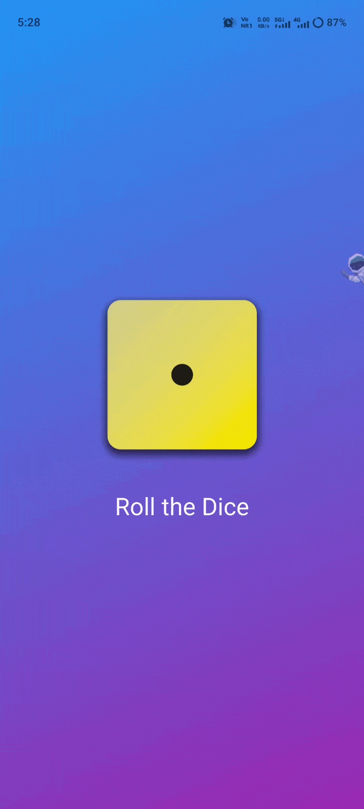
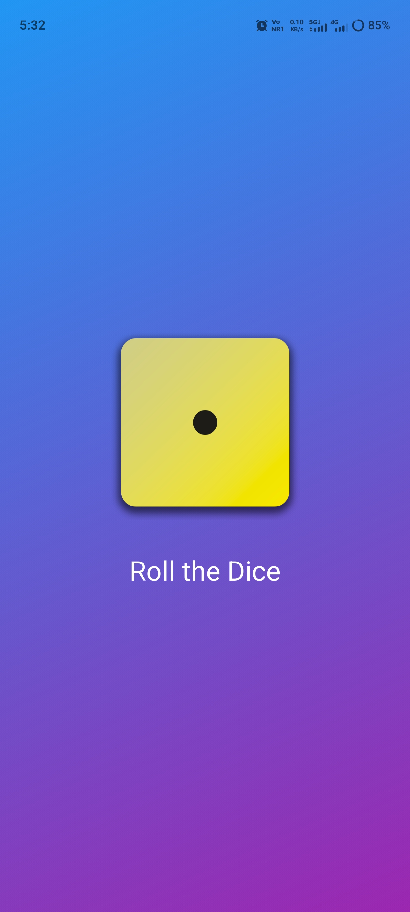

# 🎲 Roll a Dice App

A simple Flutter application that simulates rolling a dice. Tap the dice and get a random number between 1 and 6 with an updated dice face image.

This project is perfect for Flutter beginners who want to understand:

- Stateful Widgets
- User Interaction
- Random Number Generation
- Image Assets
- Flutter Layouts
- Basic App Development

---

## 📱 Features

- 🎲 Roll a dice with a tap
- 📳 Vibration feedback on every roll
- 📱 Shake the device to roll automatically
- 🔄 Random dice generation (1–6)
- 🖼️ Dynamic dice face updates
- ⚡ Lightweight and responsive UI
- 📚 Beginner-friendly Flutter project
- 🌍 Cross-platform Flutter application

---

## 🎥 Demo

### Roll Methods

#### Tap to Roll
Tap the dice image to generate a random dice value.

#### Shake to Roll
Shake your device to trigger an automatic dice roll.

>  .

---

## 📸 Screenshots

Add screenshots of your application here.

| Home Screen |
|------------|
|  |

---

## 🛠️ Built With

- Flutter
- Dart

### Packages Used

#### Shake

Detects device shake gestures.

```yaml
shake: ^3.0.0
```

#### Vibration

Provides haptic feedback when the dice is rolled.

```yaml
vibration: ^3.1.3
```

---

## 🚀 Getting Started

### Prerequisites

Before running the project, make sure you have:

- Flutter SDK installed
- Dart SDK installed
- Android Studio or VS Code
- Android Emulator or Physical Device

Check your Flutter installation:

```bash
flutter doctor
```

---

## 📦 Installation

### Clone the Repository

```bash
git clone https://github.com/webdevsaravanan/Roll-a-Dice-App.git
```

### Navigate to the Project

```bash
cd Roll-a-Dice-App
```

### Install Dependencies

```bash
flutter pub get
```

### Run the Application

```bash
flutter run
```

---

## 📂 Project Structure

```text
Roll-a-Dice-App/
│
├── android/
├── ios/
├── linux/
├── macos/
├── windows/
├── web/
│
├── assets/
│   └── images/
│       ├── dice-1.png
│       ├── dice-2.png
│       ├── dice-3.png
│       ├── dice-4.png
│       ├── dice-5.png
│       └── dice-6.png
│
├── lib/
│   └── main.dart
│
├── pubspec.yaml
├── README.md
└── analysis_options.yaml
```

---

## 🧠 How It Works

### Tap to Roll

1. User taps the dice image.
2. A random number between 1 and 6 is generated.
3. The dice face image updates.
4. The device vibrates briefly.

### Shake to Roll

1. The app listens for shake events using the `shake` package.
2. When a shake is detected:
   - A random dice value is generated.
   - The dice image updates.
   - Vibration feedback is triggered.

### Random Number Generation

```dart
final diceNumber = Random().nextInt(6) + 1;
```

### State Update

```dart
setState(() {
  currentDice = diceNumber;
});
```

---

## 📚 Flutter Concepts Covered

### Widgets

- MaterialApp
- Scaffold
- Center
- Column
- Image
- GestureDetector

### State Management

- StatefulWidget
- setState()

### Dart Concepts

- Variables
- Functions
- Random Class
- Event Handling

### Device Features

- Accelerometer-based shake detection
- Haptic feedback (vibration)

---

## 🔄 Application Flow

```text
App Launch
    │
    ▼
Display Dice
    │
    ▼
User Action
(Tap or Shake)
    │
    ▼
Generate Random Number
    │
    ▼
Update Dice Image
    │
    ▼
Trigger Vibration
    │
    ▼
Show Result
```

---

## 🎯 Learning Outcomes

By building this project, you will learn:

- Flutter project structure
- Stateful widgets
- User interaction handling
- Random number generation
- Asset management
- Third-party package integration
- Device sensor usage
- Haptic feedback implementation

---

## 🌟 Future Improvements

- Add dice rolling animation
- Add sound effects
- Maintain roll history
- Multiple dice support
- Dark mode
- Statistics dashboard
- Custom vibration settings
- Dice themes and skins

---

## 👨‍💻 Author

**Saravanakumar Senthilkumar**

GitHub: https://github.com/webdevsaravanan

---

## 📄 License

This project is licensed under the MIT License.

Feel free to use, modify, and distribute it for learning and educational purposes.
